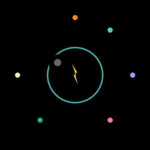

# 「电竞天赋检测站」项目介绍文档

---

## 一、项目概览

**项目名称：** 电竞天赋检测站（天赋指数 Talent Index）

**一句话介绍：**
6项趣味挑战测试反应、手速、视野、追踪、记忆、协调能力，30秒测一项，扫码即玩，看看谁是电竞天才。

---

## 二、为什么做 (Why)

### 1. 受众是谁？

- **核心用户**：16-30岁FPS游戏玩家（王者荣耀、和平精英、CSGO等）
- **使用场景**：游戏等待加载时、休息间隙、朋友聚会时想测一测
- **心理特征**：好奇自己能不能打职业、想和朋友比分数、有炫耀心理

### 2. 你想为他们创造什么？

**痛点观察：**
很多玩家想知道"我反应到底算不算快"，但网上没有简单好玩的测试工具。能测的要么界面太丑、要么太专业不想用、要么要下载App。

**想创造的体验：**
扫码就能玩、30秒出结果、有分数有称号、可以截图分享。专业感+趣味性结合，让测评变得像游戏一样好玩。

### 3. 现有方案缺什么？

- ❌ 专业电竞测评网站太丑太复杂
- ❌ 小程序测试太简单没诚意
- ❌ 没有社交分享价值，分享出去不酷
- ❌ 无法在抖音内置浏览器直接打开（需下载）

---

## 三、做了什么 (What)

### 功能1：6项专业能力测试

**功能名称：** 六维电竞能力测评

**设计意图：** 覆盖电竞最核心的6项能力，用30秒趣味挑战量化评估

| 测试 | 内容 | 评分标准 |
|------|------|----------|
| 反应速度 | 等待变绿后立刻点击，测反应时间 | <180ms天才级 |
| 极限手速 | 30秒内点击橙色球，测点击次数 | ≥80次天才级 |
| 视野广度 | 0.9秒记忆彩色圆点数量 | 3/3正确天才级 |
| 动态追踪 | 圆圈追踪移动小球，测持续时间 | >25秒天才级 |
| 顺序记忆 | 记住箭头亮起顺序并重复 | ≥9步天才级 |
| 手眼协调 | 滑块接住下落小球 | ≥20个天才级 |

**关键流程：**
```
首页选择游戏 → 规则页了解玩法 → 开始测试 → 即时显示成绩 → 历史最佳存档
```

### 功能2：专业级视觉与体验

**设计意图：** 打造"专业工具"的质感，不是廉价小游戏

**视觉特点：**
- 纯黑背景 + 橙色电竞主题色（#ff8c00）
- 网格线背景营造科技感
- 粒子爆裂、脉动发光等动效
- 等宽字体 + 简洁HUD设计

### 功能3：历史最佳成绩存档

**设计意图：** 激励重复挑战，建立用户粘性

- localStorage本地存储
- 新纪录时高亮提示
- 每项测试独立存档
- 可随时查看历史最佳

---

## 四、未来规划

### 近3个月：
- 上线微信分享功能（生成成绩图片）
- 添加全国排行榜
- 优化6个游戏的数值平衡

### 中长期（1年内）：
- 支持微信登录云端存档
- 添加更多测试维度（如音频反应、多目标追踪）
- 推出"电竞潜力报告"生成器

### 商业化设想：
- 皮肤/主题付费解锁
- 品牌联名（如游戏鼠标垫品牌）
- B端输出：作为电竞战队招募初筛工具

---

## 产品截图

**首页**


**反应速度测试**


**结果页**


---

*文档版本：v1.0 | 创建日期：2026-05-24*